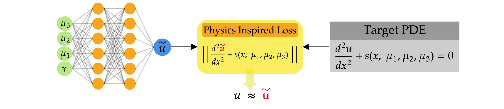

# **Physic Informed Neural Networks**

This repository is dedicated to Physics-Informed Neural Networks (PINNs), and it offers a versatile platform for solving a broad spectrum of Partial Differential Equations (PDEs). 
It encapsulates the capability to implement and explore all the problems described in the follwing research papers.
- [Estimates on the generalization error of physics-informed neural networks for approximating PDEs](https://academic.oup.com/imajna/article/43/1/1/6503953)
- [Physics informed neural networks for simulating radiative transfer](https://www.sciencedirect.com/science/article/pii/S0022407321001989m)
- [Physics informed neural networks (PINNs) for approximating nonlinear dispersive PDEs](https://arxiv.org/pdf/2104.05584.pdf)
- [Estimates on the generalization error of physics-informed neural networks for approximating a class of inverse problems for PDEs](https://academic.oup.com/imajna/article/42/2/981/6297946)

More specifically here we provide the following test cases, more will be added over time:

- Heat equation in a rectangular domain:

   $$u_t = ku_{xx}, \quad (t,x)\in[0,T]\times[-1,1]$$
   
   $$u(0, x)=-\sin(\pi x) \quad x\in[-1,1]$$
   
   $$u(t, x=0)=u(t,x=1)=0 \quad t\in[0,T]$$

  This represents the heat equation with Dirichlet boundary conditions and an initial condition given by a sine function.

- Poisson equation in an L-shaped domain:

  $$\Delta u = f, \quad (x,y) \text{ in } D$$
  
  $$u = 0, \quad (x,y)\in\partial D$$

  The L-shaped domain $D$ is defined by its boundary $\partial D$, and $f$ is the source term.

- Radiative transfer equation in 1 space dimension:

  $$\mu\frac{\partial }{\partial x}u(x,\mu) + \Big(\sigma(x) + k(x)\Big) u(x,\mu) = \frac{\sigma(x)}{2}\int_{-1}^{1}\Phi(\mu, \mu')u(x,\mu')d\mu', \quad \mu=\cos(\theta), \quad (x,\mu) \in [0,1]\times[-1,1].$$
  
  $$u = 0 \quad (x,\mu) \in \Gamma_{-}$$

  with $\Gamma_-= \{(x,\mu)\in [0,1] \times [-1,1] : \mu \cdot n(x) <0\}$ being the inflow domain and $n$ the unit normal to the boundary of domain $[0,1]$.

- Data assimilation problem for the Poisson equation:

  $$\Delta u = -f$$
  
  $$u = g, \quad (x,y) \in D'$$

  where $D'$ is a subset of the domain $D$ in which the data assimilation is performed.

- Solution of Eigenvalue problem in 1D

  $$u_{xx} + \lambda u = 0$$
  
  $$u(x=0)=u(x=1)=0 \quad t\in[0,1]$$

  This problem involves finding the eigenpairs $(\lambda_n, u_n)$, $n=1,...,N$ for the Laplacian in a one-dimensional domain.


Let us consider the problem with the heat equation.
We want to obtain an approximate solution of the heat equation $u : [0,T]\times[-1,1] \mapsto R$ with physics informed neural networks (PINNs).

To do so, we approximate the underlying solution with a feedforward dense neural network with tunable parameters $\theta$:

$$u_\theta(t,x) \approx u(t,x)$$
Define the following residuals:
- Interior residual given by,
  $$r_{int,\theta}(t, x):= u_{\theta, t}(x,t)  - u_{\theta, xx}(x,t), \quad \forall ~(t,x) \in [0,T]\times[-1,1] $$
- Spatial boundary residual given by,
  $$r_{sb,\theta}(t,-1):= u_{\theta}(t,-1)- u_b(t,-1), \quad r_{sb,\theta}(t,1):= u_{\theta}(t,1)- u_b(t,1), \quad \forall t \in (0,T].$$
- Temporal boundary residual given by,
  $$r_{tb,\theta}(x):= u_{\theta}(x,0) - u_0(x), \quad \forall x \in [-1,1].$$
and compute the corresponding loss functions:

$$
L_{int}(\theta) = \int_{[0,T]\times[-1,1]}r_{int,\theta}^2(t, x) dtdx, \quad
L_{sb}(\theta) = \int_{[0,T]}r_{sb,\theta}^2(t,-1) dt + \int_{[0,T]}r_{sb,\theta}^2(t,1)dt, \quad
L_{tb}(\theta) = \int_{[-1,1]}r_{tb,\theta}^2(x) dx
$$

The loss functions include integrals that can be approximated by suitable quadrature rule. We use quasi Monte-Carlo and accordingly define the following training sets

$$
S_{int} =\{y_n\}, \quad 1 \leq n \leq N_{int},\quad y_n = (x,t)_n \in D_T,
$$

$$
S_{sb, -1} =\{t_n, u_b(t_n,-1) \}, \quad1 \leq n \leq N_{sb}, t_n \in [0,T],
$$

$$
S_{sb, 1} =\{t_n, u_b(t_n,1) \}, \quad1 \leq n \leq N_{sb}, t_n \in [0,T],
$$

$$
S_{tb}=\{x_n, u_0(x_n)\}\quad  1 \leq n \leq N_{tb}, x_n \in [-1,1].
$$

with the training inputs points corresponding to low-discrepancy Sobol sequences.

$$
L_{int}(\theta) = \frac{1}{N_{int}}\sum_{i=1}^{N_{int}}r_{int,\theta}^2(y_n), \quad
L_{sb}(\theta) = \frac{1}{N_{sb}}\sum_{i=1}^{N_{sb}}r_{sb,\theta}^2(t_n,-1) + \frac{1}{N_{sb}}\sum_{i=1}^{N_{sb}}r_{sb,\theta}^2(t_n,1), \quad
L_{tb}(\theta) = \frac{1}{N_{tb}}\sum_{i=1}^{N_{tb}}r_{tb,\theta}^2(x_n)
$$

and solve the following minimization problem

$$
\theta^\ast = argmin_{\theta} \Big(L_{int}(\theta) + \lambda_u L_u(\theta)\Big)
$$

with

$$
L_u(\theta) = L_{tb}(\theta) + L_{sb}(\theta)
$$

## Project Structure

The project is organized such that each problem is encapsulated within its own file inside the `EquationModels` directory. For instance, the heat equation is handled by the file `HeatEquation.py`.

### Heat Equation Example

Within `HeatEquation.py`, the `EquationClass` inherits from `EquationBaseClass`. This class initializes with specific network and additional hyperparameters, setting up the domain and the model:

```python
class EquationClass(EquationBaseClass):

    def __init__(self, network_hyperparameters, additional_hyper_parameters):
        super().__init__(network_hyperparameters, additional_hyper_parameters)
        """
        Initializes the EquationClass with specific network and additional hyperparameters. 
        Sets the output, space, and time dimensions, as well as the extrema values for the problem domain. 
        It also initializes the model and parameters.

        Args:
          network_hyperparameters: A dictionary containing hyperparameters for the network.
          additional_hyper_parameters: A dictionary containing additional hyperparameters, including types of points for the problem.
        """

        self.type_of_points = additional_hyper_parameters["point"]
        self.output_dimension = 1
        self.space_dimensions = 1
        self.time_dimensions = 1
        
        # Extrema of the domain [0,T]x[-1,1]
        self.extrema_values = torch.tensor([[0, 1],
                                            [-1, 1]])

        self.input_dimensions = self.extrema_values.shape[0]

        self.T = self.extrema_values[0, 1]
        self.x0 = self.extrema_values[1, 0]
        self.xL = self.extrema_values[1, 1]
        self.k = 0.2

        assert self.input_dimensions is not None, "The variable input_dimensions has not been initialized in the child class."
```

**Step 1. The approximate solution.** First, we approximate the solution to the PDE with a Neural Network, specifically a Multi-Layer Perceptron (MLP). The network is initialized using:
```python
self.init_model()
self.init_params()
```
```python
def init_model(self):
    """
    Initializes the neural network model by creating an instance of MLP with the specified input and output dimensions and hyperparameters.
    """
    # #####################################################################################################################################
    # Model Creation
    print("Model Creation")
    self.model = MLP(input_dimension=self.input_dimensions, output_dimension=self.output_dimension, hyper_parameters=self.network_hyperparameters)
    self.model.to(self.device)
```

**Step 2. Training set.** The training set, comprising interior, spatial and temporal boundary points, is defined through dedicated functions:
```python
    def add_boundary_points(self, n_boundary, random_seed):
        """
        Generates boundary points for the domain.

        Args:
          n_boundary: Number of boundary points to generate.
          random_seed: Seed for random number generator to ensure reproducibility.

        Returns:
          A tuple of tensors representing the input and output for the boundary points.
        """
        t = torch.linspace(0, self.T, n_boundary + 1).reshape(-1, 1)
        dt = (t[1] - t[0]) / 2
        t = t[:-1] + dt

        x0 = torch.full_like(t, self.x0)
        xL = torch.full_like(t, self.xL)

        inputs_0 = torch.cat((t, x0), -1)
        inputs_L = torch.cat((t, xL), -1)

        outputs_0, _ = self.ub0(t)
        outputs_L, _ = self.ub1(t)
        inputs = torch.cat((inputs_0, inputs_L))

        outputs = torch.cat((outputs_0, outputs_L))

        return inputs, outputs
```

```python
def add_initial_points(self, n_initial, random_seed):
        """
        Generates initial points for the problem.

        Args:
          n_initial: Number of initial points to generate.
          random_seed: Seed for random number generator to ensure reproducibility.

        Returns:
          A tuple of tensors representing the input and output for the initial points.
        """
        x_vec = torch.linspace(self.x0, self.xL, n_initial + 1).reshape(-1, 1)

        dx = (x_vec[1] - x_vec[0]) / 2
        x_vec = x_vec[:-1] + dx
        inputs = torch.cat((torch.full(size=(n_initial, 1), fill_value=0.0), x_vec), -1)
        outputs = self.u0(x_vec)

        return inputs, outputs
```
```python
    def add_collocation_points(self, n_coll, random_seed):
        """
        Generates collocation points for the domain.

        Args:
           n_coll: Number of collocation points to generate.
           random_seed: Seed for random number generator to ensure reproducibility.

        Returns:
           A tuple of tensors representing the input and output for the collocation points.
       """

        n = int(n_coll ** 0.5) + 1
        x = torch.linspace(self.x0, self.xL, n)
        dx = (x[1] - x[0]) / 2
        t = torch.linspace(0, self.T, n)
        dt = (t[1] - t[0]) / 2
        x = x[:-1] + dx
        t = t[:-1] + dt

        inputs = torch.cartesian_prod(t, x)
        outputs = torch.zeros((inputs.shape[0], 1))

        return inputs, outputs
```
In our approach, Cartesian Grid points serve as the training samples. Alternatively, the `SquareDomain` class can automate this process. For example, refer to `EigenValueProblem1D.py` to see it in action. `SquareDomain` provides convenient built-in functions to distribute training sample points across the spatial boundaries and to apply boundary conditions for rectangular domains.
Observe that the training input samples have all common structure:
- they are tensors of shape $(n, 2)$
- the first column is the time variable.
- the second column is the space variable.
This is default practice when defining the input tensors for more general problem: time -> space -> other features.

**Step 2. Residuals.** The residuals, boundary residuals and PDE residuals are computed through:

```python
    def apply_bc(self, x_b_train, u_b_train, u_pred_var_list, u_train_var_list):
        """
        Applies boundary conditions during training.

        Args:
          x_b_train: Tensor containing the boundary training data.
          u_b_train: Tensor containing the boundary values.
          u_pred_var_list: List to store predicted boundary variables.
          u_train_var_list: List to store training boundary variables.
        """
        u_pred_b = self.model(x_b_train)
        u_pred_var_list.append(u_pred_b[:, 0])
        u_train_var_list.append(u_b_train[:, 0])
```
Also for computing the spatial boundary residuals the class *SquareDomain* can be used instead
```python
    def apply_ic(self, x_u_train, u_train, u_pred_var_list, u_train_var_list):
        """
        Applies initial conditions during training.

        Args:
          x_u_train: Tensor containing the initial condition training data.
          u_train: Tensor containing the initial condition values.
          u_pred_var_list: List to store predicted initial condition variables.
          u_train_var_list: List to store training initial condition variables.
        """
        for j in range(self.output_dimension):
            if x_u_train.shape[0] != 0:
                u_pred_var_list.append(self.model(x_u_train)[:, j])
                u_train_var_list.append(u_train[:, j])
```
```python
    def compute_res(self, x_f_train):
        """
        Computes the residual in the PINN model for given training data.

        Args:
          x_f_train: Tensor containing training data for residual computation.

        Returns:
          Tensor containing computed residuals.
        """
        x_f_train.requires_grad = True
        u = self.model(x_f_train).reshape(-1, )
        inputs = torch.ones((x_f_train.shape[0],))

        grad_u = torch.autograd.grad(u, x_f_train, grad_outputs=inputs.to(self.device), create_graph=True)[0]

        grad_u_t = grad_u[:, 0]

        grad_u_x = grad_u[:, 1]
        grad_grad_u_x = torch.autograd.grad(grad_u_x, x_f_train, grad_outputs=inputs, create_graph=True)[0]
        grad_u_xx = grad_grad_u_x[:, 1]

        residual = grad_u_t.reshape(-1, ) - self.k * grad_u_xx.reshape(-1, )
        return residual
```


The model is finally trained with the functions:
```python
    def loss(self, x_u_train, u_train, x_b_train, u_b_train, x_f_train, it, writer, p=2):
        """
        Compute the loss for the model, including contributions from boundary conditions, initial conditions, residuals, and regularization.

        Args:
          x_u_train: Tensor containing training data for initial conditions.
          u_train: Tensor containing values for initial conditions.
          x_b_train: Tensor containing training data for boundary conditions.
          u_b_train: Tensor containing values for boundary conditions.
          x_f_train: Tensor containing training data for residuals.
          it: Current iteration number.
          writer: Writer object for logging.
          p: Order of the norm for the loss calculation.

        Returns:
          A tuple containing total loss, loss from variables, and loss from PDE residuals.
        """
        ...
```

```python
    def fit(self, training_set_class, verbose=False, writer=None, folder=None, p=2):
        """
        Trains the model using the provided dataset. Iterates through epochs, applies optimizer steps, and logs training progress and losses.

        Args:
          training_set_class: An instance of DefineDataset containing training data.
          verbose: Boolean flag to control the verbosity of the training process.
          writer: Writer object for logging training metrics.
          folder: Path to the folder for saving the model periodically.
          p: Order of the norm for the loss calculation.

        Returns:
          A dictionary containing final training errors including 'final_error_train', 'error_vars', and 'error_pde'.
        """
```

To run the code, type
```
python3 RunPINN.py
```
The hyperparameter can be set in the file *Config.py*. 
To chnage the problem, modify the variable *module_name*
```python
def initialize_inputs(len_sys_argv):
    # Define the module name
    # Choose one among the files in the EquationModels folder:
    #    - HeatEquation
    #    - PoissonDomainL
    #    - RadiativeTransfer1D
    #    - PoissonDAP
    #    - EigenValueProblem1D
    module_name = "HeatEquation"

    # Dynamic import of EquationClass
    EquationClass = getattr(importlib.import_module(f"EquationModels.{module_name}"), "EquationClass")
```
In the case default parameters are preferred, set within the function above
```python
use_default = True
```

### Using the SquareDomain Class

The `SquareDomain` class simplifies the handling of boundary conditions. Initialize it with the output dimension, time dimensions, space dimensions, list of boundary conditions, extrema values, and type of points:
```python
self.list_of_BC = list([[self.ub0x, self.ub1x]])

self.square_domain = SquareDomain(self.output_dimension,
                                  self.time_dimensions,
                                  self.space_dimensions,
                                  self.list_of_BC,
                                  self.extrema_values,
                                  self.type_of_points)
```
The `list_of_BC` variable specifies the boundary conditions to be applied at the edges $x=0$ and $x=1$ for one-dimensional problems:
```python
def ub0x(self, inputs):
    type_BC = [DirichletBC()]
    u = torch.full(size=(inputs.shape[0], 1), fill_value=0.0)
    return u, type_BC
```
In this scenario, zero-valued Dirichlet boundary conditions (BCs) are enforced via the `square_domain.apply_boundary_conditions function:
```python
def apply_bc(self, x_b_train, u_b_train, u_pred_var_list, u_train_var_list):
    self.square_domain.apply_boundary_conditions(self.model, x_b_train, u_b_train, u_pred_var_list, u_train_var_list)
```
To incorporate Neumann boundary conditions, simply modify the boundary condition type accordingly.
```python
type_BC = [NeumannBC()]
```
The functionality extends to non-constant BCs as well, which becomes particularly relevant in two-dimensional spatial domains.
```python
self.list_of_BC = list([[self.ub0x, self.ub1x],
                        [self.ub0y, self.ub1y]])

self.square_domain = SquareDomain(self.output_dimension,
                                  self.time_dimensions,
                                  self.space_dimensions,
                                  self.list_of_BC,
                                  self.extrema_values,
                                  self.type_of_points)
```
```python
def ub0x(self, inputs):
    type_BC = [DirichletBC()]
    u = inputs
    return u, type_BC
```
It is important to note that the inputs represent a set of data coordinates $(y_i)$, $i=1,...,N_{sb}$, positioned along the edge at $x=0$ in a square domain.


### Additional Equations File

The additional files offer guidance in various scenarios:

- **PoissonLDomain.py**:
  1. Implementation of a completely custom domain.
- **RadiativeTransfer1D.py**: 
  1. Implementation of a PDE with a parametric solution \(u=u(t,x,\mu)\).
  2. Incorporation of a non-local term in the PDE.
- **PoissonDAP.py**:
  1. Tackling an inverse problem (data assimilation problem).
- **EigenValueProblem1D.py**:
  1. Utilization of a custom fit and loss function.
  2. Employment of an additional network to approximate other elements of the PDE. For instance, a network for the eigenvalue $\lambda$ is used. This approach is particularly beneficial for solving other inverse problems aimed at approximating both the solution and additional coefficients in the PDE.
